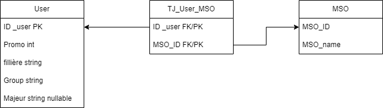

# Messenger chat bot for student timetable

With [@jo-pouradier](https://github.com/jo-pouradier), we created a chat bot for Messenger to help students to get their timetable on messenger which is much eassier than a long and fastidious excel file. 
That's why we created [CPE Planning | Facebook](https://www.facebook.com/profile.php?id=100090769200025). 
It's a 24/7 chat bot running with Nodejs on our personnal home lab.

The first version was made by @waleedahmad with his [Aww-Bot | Github](https://github.com/waleedahmad/Aww-Bot).

## _Summary_

- [Messenger chat bot for student timetable](#messenger-chat-bot-for-student-timetable)
  - [_Summary_](#summary)
  - [Installation](#installation)
  - [Usage](#usage)
  - [Legal](#legal)
  - [Database](#database)
    - [Database MPD](#database-mpd)
  - [Recover timetable data from pdf](#recover-timetable-data-from-pdf)
  - [TODO](#todo)

## Installation

/!\ It is really complicated to install a chat bot on messenger, be ready to spend a lot of time on it. /!\
Fist you need a Facebook page connected with messenger to get a personnal token. Then you need to create a server with an https address (you can use `ngrok`, `localtunnel`, or a personnal domain). Then run a nodejs server (I first tried with a python flask server... no sucess) where the url `/webhook` verify your secret token. Finally your chat bot can be used by developpers and admins! For your app to be accessible to anyone, you need to submit it to Facebook for review, with a privacy policy (more in our [Legal](#legal) part).

## Usage

The **get_started** button is the first thing you see when you open the chat bot. It's a simple button that register the user in the database while asking for his promotion, group and major if necessary.
For the database, we are using a local sqlite file to store the user's data. And a json file to store the timetable. 
We are reccording the user's :
 - id (chat id from facebook)
 - promotion (3A or 4A)
 - group (A, B, C or D)
 - major (only for 4ETI students)

Then we send to the user a message with a button for each day of the week. When the user click on a button, we send him a message with the timetable of the day according to his promotion and major. The group is not taken into account for the moment it is way too complicated because of the pdf file and too many of unplanned format.  

For the moment the timetable is only available for 4ETI students. We are working on it to make it available for all students.

## Legal

To make your app accessible to anyone, you need to submit it to Facebook for review, with a privacy policy. You can use [PrivacyPolicies.com](https://www.privacypolicies.com/) to create your privacy policy. It is free and easy to use.
Below is our privacy policy and service requirement.
Webgenarator : [app.privacypolicies.com](https://app.privacypolicies.com/profile/agreements)
- Privacy policy webhosted : [Here](https://www.privacypolicies.com/live/bcce1178-a9c6-4135-988c-ef12048878fa)
  - or in Markdown localy : [Here](./Docs/PrivacyPolicyCPEPlanning.md)

## Database

For the database we are using an sqlite database. This version works for all students. For the MSO we are using a joint table because of the number of MSO (about thirty).
/!\ The database is not finished yet, we are still working on it. 
The database is composed of 3 tables:  

- `users` :
    - `id_user` : the user's id
    - `promo` : the user's promotion
    - `filliere` : the user's fillière
    - `groupe` : the user's group
    - `majeur`: the user's major
- `TJ_User_MSO` :
  - `id_user` : the user's id
  - `id_mso`: the user's MSO
- `MSO` :
  - `id_mso` : the MSO's id
  - `name_mso` : the MSO's name
  
### Database MPD

## Recover timetable data from pdf

## TODO
- [X] Make json file for all variables
- [X] Repair isKnown function
- [X] Manage CGP Table
- [X] Manage reinscription 4CGP (mso)
- [ ] Manage LV lessons
- [X] Manage 3A lessons
- [X] Create MSO TABLE
- [X] Manage groups but not for 4A
- [ ] Manage database backup and restore (cron?)
- [X] Use another file to store templates
- [ ] Script to send planning automatically at 7h30am
- [X] Manage SQL errors (try catch)
- [X] Make a better readme 
- [ ] Make a better code
- [ ] For the future : make a web interface for CPE admin to post the planning (manage timetable)
- [X] Make more comments in the code so it's easier to understand when you come back to it after a long time
- [ ] Don't share the token on github !!!!!!!!!
- [ ] Don't share the code to  ETI students !!!!!!!!!
- [ ] Regex expression for hours  
- [ ] React site si y a vraiment plus rien à faire