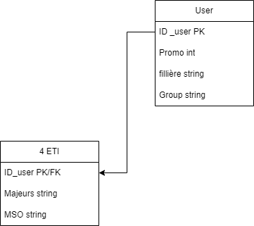
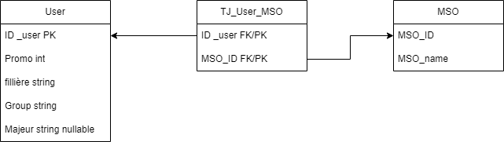

# Messenger chat bot for student timetable

With [@jo-pouradier](https://github.com/jo-pouradier), we created a chat bot for Messenger to help students to get their timetable on messenger which is much eassier than a long and fastidious excel file. 
That's why we created [CPE Planning | Facebook](https://www.facebook.com/profile.php?id=100090769200025). 
It's a 24/7 chat bot running with Nodejs on our personnal home lab.

The first version was made by @waleedahmad with his [Aww-Bot | Github](https://github.com/waleedahmad/Aww-Bot).

### _Summary_

- [Messenger chat bot for student timetable](#messenger-chat-bot-for-student-timetable)
    - [_Summary_](#summary)
  - [Installation](#installation)
  - [Usage](#usage)
    - [Registre users](#registre-users)
- [Legal](#legal)
- [DATABASE](#database)
  - [Database structure V1](#database-structure-v1)
  - [Database structure V2](#database-structure-v2)
- [TODO](#todo)

## Installation

/!\ It is really complicated to install a chat bot on messenger, be ready to spend a lot of time on it. /!\
Fist you need a Facebook page connected with messenger to get a personnal token. Then you need to create a server with an https address (you can use `ngrok`, `localtunnel`, or a personnal domain). Then run a nodejs server (I first tried with a python flask server... no sucess) where the url `/webhook` verify your secret token. Finally your chat bot can be used by developpers and admins! For your app to be accessible to anyone, you need to submit it to Facebook for review, with a privacy policy (more in our [Legal](#legal) part).

## Usage

The **get_started** button is the first thing you see when you open the chat bot. It's a simple button that register the user in the database while asking for his promotion, group and major if necessary.
For the database, we are using a local sqlite file to store the user's data. And a json file to store the timetable. 
We are reccording the user's :
 - id (chat id from facebook)
 - promotion (3A or 4A)
 - group (A, B, C or D)
 - major (only for 4ETI students)

Then we send to the user a message with a button for each day of the week. When the user click on a button, we send him a message with the timetable of the day according to his promotion and group.

### Registre users

Utilisastion d'un json comme pour la config du bot.  
Depuis le bouton de démarrage, on verifie que l'`id` existe dans la DB, si non on l'ajoute et on lui demande sa promotion, son groupe et sa filière si nécessaire grace a une série de messages avec un `postback`. 

# Legal

To make your app accessible to anyone, you need to submit it to Facebook for review, with a privacy policy. You can use [PrivacyPolicies.com](https://www.privacypolicies.com/) to create your privacy policy.
Below is our privacy policy and service requirement.
Webgenarator : [app.privacypolicies.com](https://app.privacypolicies.com/profile/agreements)
- Privacy policy webhosted : [Here](https://www.privacypolicies.com/live/b31b8520-640b-40d1-b43c-52033d7e05fa)
  - or in Markdown localy : [Here](./Docs/PrivacyPolicy.md)
- Service requirement webhosted [Here](https://www.privacypolicies.com/live/897d7376-61c0-473c-834b-cfcf6d0d0dcd)
  - or in Markdown localy : [Here](./Docs/ServiceRequirement.md)

# DATABASE
## Database structure V1

For the first version of the data base we use a sqlite database. This first version only works for 4ETI students.
The database is composed of 2 tables :
 - `users` : 
    - `ID_user` : the user's id
    - `Promo` : the user's promotion
    - `Filliere` : the user's fillière
    - `group` : the user's group
 - `4ETI` :
  - `ID_user` : the user's id
  - `Major`: the user's major
  - `MSO`: the user's MSO

## Database structure V2

For the second version of the data base we use a sqlite database. This version works for all students. with a jointture table for the MSO.

- `users` : 
    - `ID_user` : the user's id
    - `Promo` : the user's promotion
    - `Filliere` : the user's fillière
    - `group` : the user's group
    - `Major`: the user's major
- `TJ_User_MSO` :
  - `ID_user` : the user's id
  - `MSO`: the user's MSO
- `MSO` :
  - `ID_MSO` : the MSO's id
  - `MSO` : the MSO's name

# TODO

- [ ] Manage CGP Table
- [ ] Manage LV lessons
- [ ] Manage 3A lessons
- [ ] Create MSO TABLE
- [ ] Manage groups
- [ ] manage data base backup and restore
- [ ] script to send planning automatically